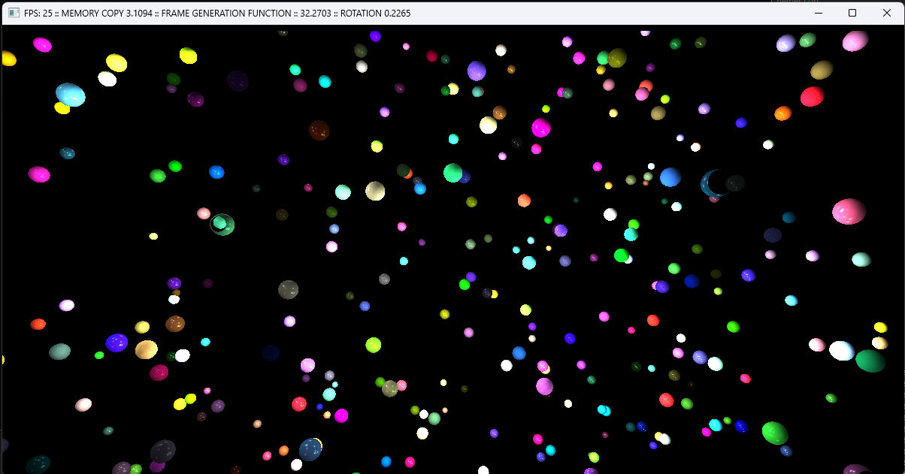

# CUDA Ray Casting Project

## Overview
This project implements a ray casting technique using CUDA to render a large number of spheres efficiently. The application leverages GPU acceleration to compute the rendering of spheres with real-time interactions, including rotation and animation. The implementation includes a choice between CPU and GPU rendering modes.

## Features
- **CUDA-based ray casting** for efficient sphere rendering.
- **GLFW-based window management** for interactive visualization.
- **Support for CPU and GPU rendering modes**, toggled with the `C` key.
- **Real-time object rotation** using mouse interaction.
- **Dynamic resizing support** for different screen sizes.
- **Customizable number of spheres and light sources** using command-line arguments.

## Dependencies
Ensure the following dependencies are installed before building the project:
- **CUDA Toolkit**
- **GLFW**
- **OpenGL**
- **NVIDIA GPU with CUDA support**

## Usage
- **Toggle animation**: Press `SPACE`.
- **Toggle light rotation**: Press `LEFT SHIFT`.
- **Switch rendering mode**: Press `C` to switch between CPU and GPU rendering.
- **Adjust number of spheres**: Use `-s <number>` when running the application.
- **Adjust number of light sources**: Use `-l <number>` when running the application.

## Controls
- **Mouse Drag (Left Button)**: Rotate spheres or lights.
- **Keyboard Shortcuts**:
  - `SPACE`: Toggle animation.
  - `LEFT SHIFT`: Toggle light rotation.
  - `C`: Toggle rendering mode.

